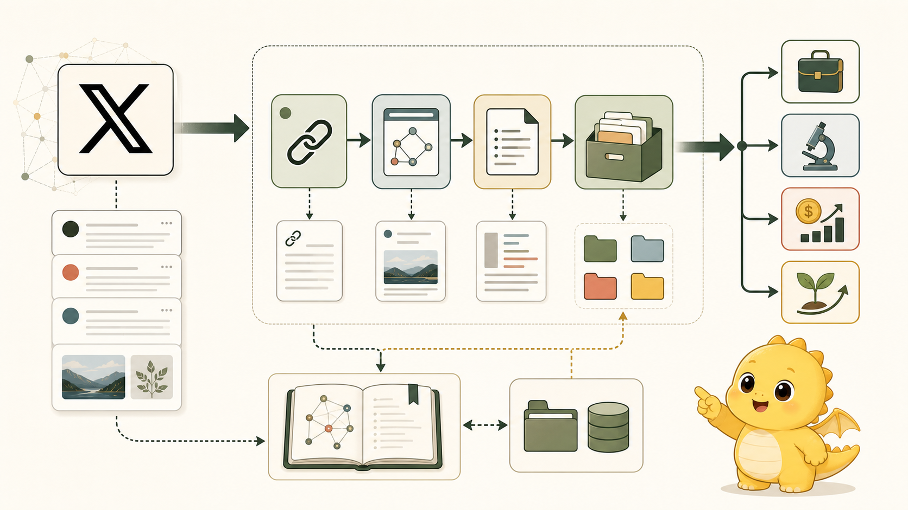

<p align="center">
  
</p>

<p align="center">
  <a href="./README.md">English</a> / <strong>简体中文</strong>
</p>

<h1 align="center">X 文章馆</h1>

<p align="center">
  把公开 X 长文收进你的本地研究书架：项目库、Markdown 文章、持续生长的元文章。
</p>

<p align="center">
  <a href="#快速开始">快速开始</a> ·
  <a href="#它能做什么">功能</a> ·
  <a href="#阅读器与元文章">阅读器</a> ·
  <a href="./README.md">English</a>
</p>

<p align="center">
  
  
  
</p>

X 文章馆可以帮助你收集公开推文和 X Article，适合商业研究、AI 研究、市场观察、创作者内容分析等工作流。启动本地应用后，你可以新建项目、粘贴公开 X status 链接，并把文章保存为项目里的 Markdown。每个项目都会维护一篇 `meta.md` 元文章，用来沉淀项目库，方便后续做摘要总结。

它**不会**绕过登录、付费墙、私密账号、平台访问控制或版权规则。

## 为什么做这个

X 上有很多有价值的长文和 Article，但研究链接经常散落在收藏夹、聊天记录和临时截图里。为了合法研究、个人资料归档和 AI 辅助笔记，这个项目提供一个本地工作流：

- 为一个选题、市场、创作者或研究问题创建项目。
- 粘贴一个公开 X status URL。
- 把文章保存成可读 Markdown。
- 在内置阅读器里直接阅读。
- 为每个项目维护一篇 `meta.md` 元文章。
- 按需导出元数据、JSON Feed、RSS 和原始 JSON。

## 它能做什么

- **项目库**：创建本地项目，把 X 文章收进对应项目。
- **单链接收录**：粘贴公开 `/status/<id>` URL，保存 Markdown 和 raw JSON。
- **美观阅读**：点击已收录文章，直接进入本地 Markdown 阅读器。
- **元文章**：每个项目维护一篇持续生长的 `meta.md`。
- **批量研究**：通过 CLI 处理链接列表或来源集合。
- **多格式导出**：生成 Markdown digest、JSONL 索引、JSON Feed 和 RSS。
- **Codex Skill**：内置 Skill，方便 Agent 参与后续研究流程。

## 快速开始

克隆仓库，并启动本地应用：

```powershell
git clone https://github.com/instann/x-fulltext-fetcher.git
cd x-fulltext-fetcher
python scripts/run_app.py
```

打开：

```text
http://127.0.0.1:8767/
```

在界面里：

1. 新建项目。
2. 粘贴公开 X status URL。
3. 点击 `抓取并收录`。
4. 点击已收录文章，进入 Markdown 阅读器。
5. 查看项目 `meta.md` 元文章预览，用于后续总结。

## 阅读器与元文章

每个项目都会保存到：

```text
outputs/projects/<project-id>/
|-- articles/       # 抓取后的 Markdown 文章
|-- raw/            # 保留的原始 JSON
|-- meta.md         # 项目级元文章
`-- project.json    # 本地项目索引
```

整个应用默认本地优先，不会把你的研究库上传到远程服务。

从 CLI 抓取一个公开 X status 链接：

```powershell
python scripts/fetch_x_fulltext.py "https://x.com/ambertreelet/status/2071592494245285956?s=46" --out outputs/article.md --metadata
```

批量模式：

```powershell
python scripts/fetch_x_fulltext.py --batch examples/links.txt --out-dir outputs/corpus --metadata-out outputs/corpus/metadata.json --raw-json-dir outputs/raw
```

研究 feed 模式：

```powershell
python scripts/fetch_x_fulltext.py --sources examples/sources.json --out-dir outputs/research --digest-out outputs/research/digest.md --index-out outputs/research/index.jsonl --feed-json web/feed.json --feed-rss outputs/research/feed.xml
```

作为本地 Python 包安装：

```powershell
python -m pip install -e .
x-fulltext-fetch "https://x.com/ambertreelet/status/2071592494245285956?s=46" --out outputs/article.md
x-fulltext-app
```

## CLI 输出示例

```markdown
# Super useful Article title

> Article preview...

Source: https://x.com/user/status/123
Article ID: 456

## Section
- Bullet
- Bullet
```

## 仓库结构

```text
x-fulltext-fetcher/
|-- assets/                       # README 视觉资源
|-- docs/
|   |-- LEGAL.md                  # 合规与可接受用途
|   |-- METHODS.md                # 端点说明与 fallback 策略
|   `-- ROADMAP.md                # MCP 风格扩展计划
|-- examples/
|   |-- links.txt                 # 批量输入示例
|   `-- sources.json              # 命名 X 研究来源
|-- scripts/
|   |-- fetch_x_fulltext.py       # 独立 CLI 脚本
|   `-- run_app.py                # 本地 Web 应用启动器
|-- skills/
|   `-- x-fulltext-fetcher/       # Codex Skill 包
|-- src/
|   `-- x_fulltext_fetcher/       # Python 包入口
|-- web/                          # 中文本地项目库前端
`-- tests/
```

## Codex Skill

内置 Skill 位于：

```text
skills/x-fulltext-fetcher
```

要安装到 Codex，请把该文件夹复制到你的 Codex skills 目录：

```powershell
Copy-Item -Recurse -Force .\skills\x-fulltext-fetcher "$env:USERPROFILE\.codex\skills\x-fulltext-fetcher"
```

然后可以这样让 Codex 使用：

```text
Use $x-fulltext-fetcher to fetch and summarize this X Article link: ...
```

## 工作原理

当前主要适配器使用：

```text
https://api.fxtwitter.com/{screen_name}/status/{status_id}
```

目前观察到的有用字段：

- `tweet.raw_text.text`
- `tweet.article.title`
- `tweet.article.preview_text`
- `tweet.article.content.blocks`
- `tweet.article.content.entityMap`
- `tweet.article.cover_media.media_info.original_img_url`

替代方案和限制说明见 [docs/METHODS.md](docs/METHODS.md)。

## 后续更新计划

这个项目先从稳定的“链接转 Markdown”工具开始，之后会逐步扩展成一个小型研究工作台。

### 第一阶段：稳定提取

- 支持公开 status 链接。
- 解析 X Article 内容块。
- 支持批量模式。
- 输出元数据 JSON。
- 保存原始 JSON。
- 打包 Codex Skill。

### 第二阶段：发现机制

- 命名 X 来源列表和主题标签。
- 基于搜索引擎发现候选 X status 链接。
- 按 tweet id 和 article id 去重。
- 标准化不同来源的元数据。

### 第三阶段：本地研究语料库

- 用稳定的文件夹结构保存 Markdown。
- 增加轻量 JSONL 索引。
- 增加摘要、标签和主题字段。
- 导出 JSON Feed 和 RSS。
- 在 Web 界面创建项目库。
- 每个项目维护一篇 `meta.md` 元文章。
- 支持商业与 AI 监控中的周期性研究流程。

### 第四阶段：官方 X MCP 桥接

- 增加可选适配器，连接用户本地配置的官方 X MCP 服务。
- 在用户授权凭据下支持搜索和账号相关检索。
- 保持同样的输出形态：Markdown + 元数据 + 原始数据。

### 第五阶段：Agent 工作流

- 增加抓取链接的 Codex Skill 命令。
- 支持作者和主题总结。
- 生成每周趋势摘要。
- 跨主题比较帖子。
- 导出研究笔记。

## 法律与伦理边界

本项目用于对公开 URL 进行合法、只读研究。它不是绕过限制的抓取工具。

可以：

- 尊重 X/Twitter 条款、robots、速率限制和用户隐私。
- 在需要时使用官方 API 或你自己授权的凭据。
- 在允许的情况下，将全文保存到本地用于个人或研究用途。
- 少量引用，并优先总结受版权保护的长内容。

不可以：

- 绕过登录、付费墙、访问控制或私密账号。
- 未经许可重新发布完整受版权保护的帖子或文章。
- 将工具用于垃圾信息、监控、骚扰或平台操纵。
- 声称本项目与 X/Twitter 官方有关联。

在生产环境使用前，请阅读 [docs/LEGAL.md](docs/LEGAL.md)。

## 向 MCP 风格研究栈扩展

这个仓库有意保持一个简单契约：

```text
输入 -> 公开 URL / 查询 / 批量文件
输出 -> Markdown 文件 + 元数据 JSON + 可选原始数据
```

未来的适配器都可以接入这个契约：搜索发现、官方 X MCP 集成、本地语料索引、定时监控和差异比较。

更多计划见 [docs/ROADMAP.md](docs/ROADMAP.md)。

## 免责声明

本项目是独立项目，与 X Corp. 无从属、背书或赞助关系。文中提到 "X" 和 "Twitter" 仅用于说明兼容的来源 URL。
